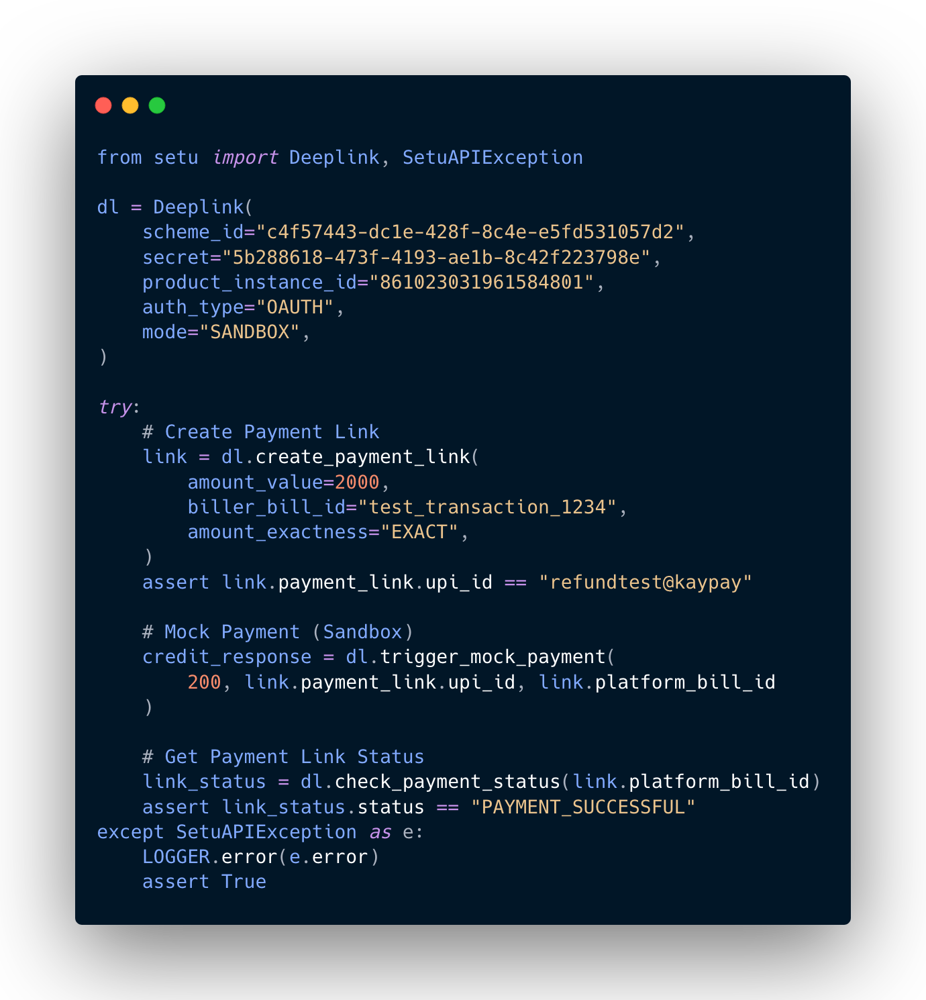

# Setu UPI DeepLinks: Python SDK

`setu` is a Python SDK for accessing Setu’s [UPI Deeplinks](https://docs.setu.co/collect/biller/upi-deep-links) APIs. The SDK is designed with ease of access in mind, with native Python class objects for inputs & ouputs and custom exceptions.

[](https://pypi.org/project/setu-python-sdk)
[](https://www.npmjs.org/package/@setu/upi-deep-links)
[](LICENSE.md)



Python package to connect to Setu's UPI Deep Link APIs

## Getting started

[SDK documentation →](https://opensource.setu.co/setu-python-sdk)
[Full documentation →](https://docs.setu.co/payments/upi-deeplinks)
[Product overview →](https://setu.co/payments/upi-deeplinks)

### Installation

```bash
pip install setu
```

### Features

-   Full support for latest UPI Deeplinks APIs
-   Native Python class objects for all inputs & responses
-   Allows both [JWT](https://docs.setu.co/payments/upi-deeplinks/resources/jwt) & [OAuth](https://docs.setu.co/payments/upi-deeplinks/resources/oauth) authentication mechanisms
-   `SANDBOX` mode to test integration & `PRODUCTION` for live data
-   Internal mechanism for OAuth authentication to automatically re-fetch token when current one expires, and retry all failed requests.

## Examples

### Setup

```python
from setu import Deeplink
from setu.contract import RefundRequestItem, SetuAPIException

dl = Deeplink(
    scheme_id="c4f57443-dc1e-428f-8c4e-e5fd531057d2",
    secret="5b288618-473f-4193-ae1b-8c42f223798e",
    product_instance_id="861023031961584801",
    auth_type="OAUTH",
    mode="SANDBOX",
)
```

### Generate UPI payment link

```python
bill_amount = 100
try:
    link = dl.create_payment_link(
        amount_value=bill_amount,
        biller_bill_id="test_transaction_1234",
        amount_exactness="EXACT",
        payee_name="Python SDK unittest",
        transaction_note="unittest transaction",
    )
    assert link.payment_link.upi_id == "refundtest@kaypay"
except SetuException as e:
    assert False
```

### Get Payment Link Status

```python
try:
    link_status = dl.check_payment_status(link.platform_bill_id)
    assert link_status.status == "BILL_CREATED"
except SetuAPIException as e:
    assert False
```

# Trigger mock payment for UPI payment link (Sandbox only)

```python
try:
    credit_response = dl.trigger_mock_payment(
        float(bill_amount) / 100, link.payment_link.upi_id, link.platform_bill_id
    )
except SetuAPIException as e:
    assert False
```

### Mock Settlement

```python
try:
    dl.trigger_mock_settlement([credit_response.utr])
except SetuAPIException as e:
    assert False
```

### Initiate Refund

```python
try:
    batch_initiate_refund_response = dl.initiate_batch_refund(
        refunds=[
            RefundRequestItem(
                identifier=link.platform_bill_id,
                identifierType="BILL_ID",
                refundType="FULL",
            ),
        ],
    )
    assert batch_initiate_refund_response.refunds[0].status == "MarkedForRefund"
except SetuAPIException as e:
    assert False
```

### Get refund batch status

```python
try:
    refund_batch_status_response = dl.get_batch_refund_status(batch_initiate_refund_response.batch_id)
    assert refund_batch_status_response.refunds[0].bill_id == link.platform_bill_id
except SetuAPIException as e:
    assert False
```

### Get individual refund status

```python
try:
    refund_status_response = dl.get_refund_status(batch_initiate_refund_response.refunds[0].id)
    assert refund_status_response.bill_id == link.platform_bill_id
except SetuAPIException as e:
    assert False
```

## Contributing

Have a look through existing [Issues](https://github.com/SetuHQ/setu-python-sdk/issues) and [Pull Requests](https://github.com/SetuHQ/setu-python-sdk/pulls) that you could help with. If you'd like to request a feature or report a bug, please [create a GitHub Issue](https://github.com/SetuHQ/setu-python-sdk/issues) using the template provided.

[See contribution guide →](CONTRIBUTING.md)

## Credits

This package was created with [Cookiecutter](https://github.com/audreyr/cookiecutter) and the [waynerv/cookiecutter-pypackage](https://github.com/waynerv/cookiecutter-pypackage) project template.

## License

MIT. Have at it.
